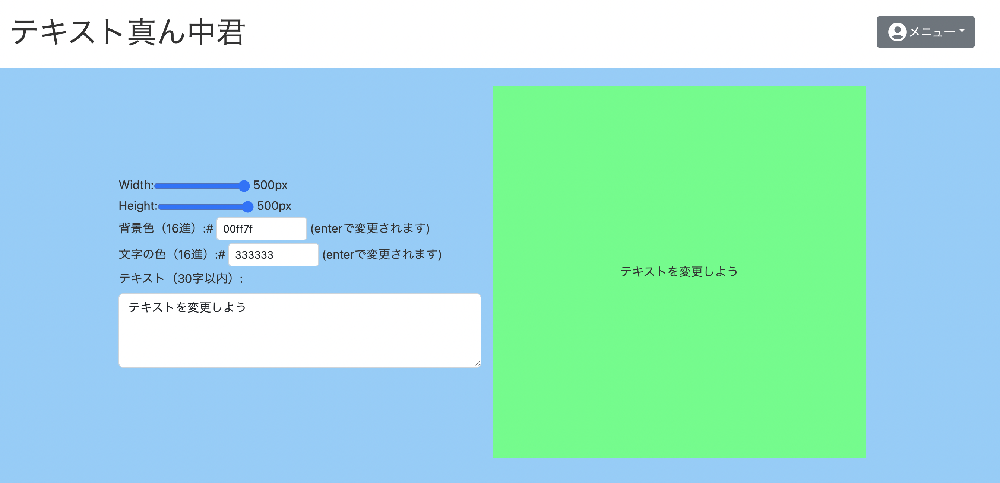
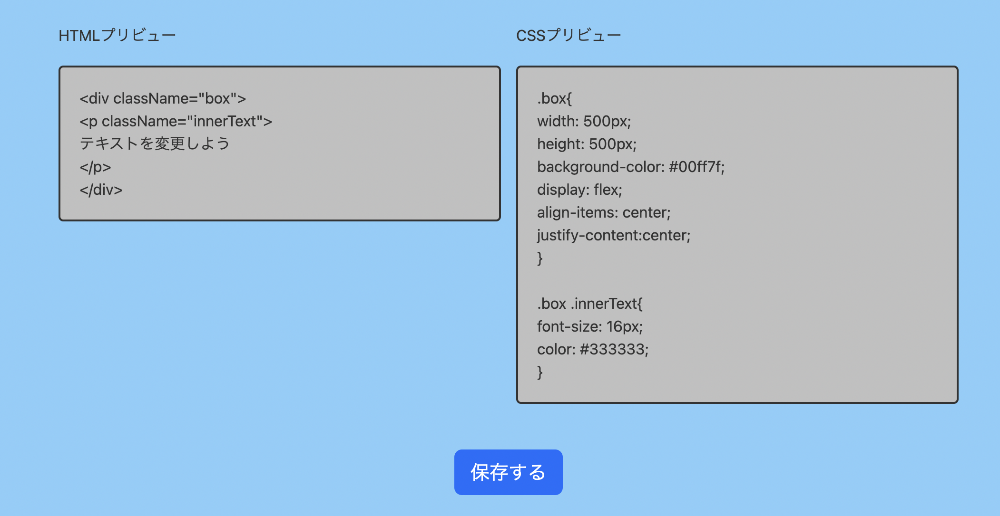

# テキスト真ん中君

テキストを文字の中央に持っていくジェネレーター 

視覚的にBOXの大きさを変更でき、
 HTML・CSSのコードが自動的に生成されます。

# 使用技術
- node 16.18.23
- react 18.2.0
  - react-icons 4.1.0
- redux 4.2.1
  - redux-toolkit 1.9.3
- bootstrap 5.1.3
  - bootstrap-icons 1.10.4
- react-router-dom 6.10.0
- firebase 9.19.1
- styled-components 5.3.9
- typescript 4.9.5

# 機能一覧
- コードの変更 (Main.tsx)
- コードの保存 (SaveBtn.tsx)
- ログイン機能
  - Googleアカウントでログイン (GoogleLogin.tsx)
- 保存コードの表示 (SaveCode.tsx)
- 保存コードの一覧表示 (MyPage.tsx)